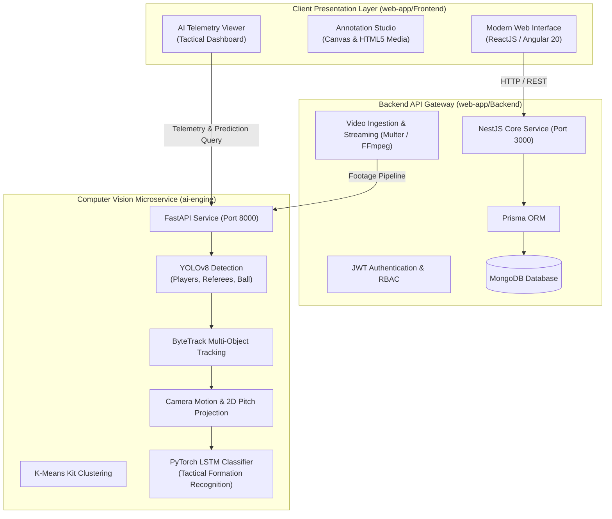

# Sports Tactics AI Analyzer

## Project Header
- **Timeline:** August 2025
- **Context:** Web & AI Research Internship @ Djagora Foundation
- **Overview:** Applied computer vision research to engineer an AI-assisted sports tactical analysis web application.

---

## Key Contributions
- Developed a custom video annotation interface utilizing modern ReactJS frameworks.
- Orchestrated and integrated third-party AI APIs to automate tactical pattern detection.
- Streamlined complex video processing workflows to enhance user experience and analytical precision.

---

## System Capabilities

### 1. Spatio-Temporal Sequence Classification
- Built a recurrent neural network architecture (**PyTorch LSTM**) trained on multi-frame positional trajectory data of outfield players and the match ball.
- Automatically recognizes and categorizes team defensive blocks into **Low Block** (*Bloc bas*), **Mid Block** (*Bloc médian*), and **High Press** (*Pressing haut*) along with probabilistic confidence scores.

### 2. Deep-Learning Object Detection and Multi-Object Tracking
- Integrated a fine-tuned **YOLOv8** model targeting domain-specific pitch entities (players, goalkeepers, referees, and the ball).
- Coupled detection with **ByteTrack** (via Roboflow Supervision) to preserve consistent tracklet IDs across camera pans, occlusions, and rapid transitions.

### 3. Automated Team Kit Segmentation via Unsupervised Clustering
- Applied unsupervised **K-Means clustering** directly to extracted player bounding box color histograms in HSV/RGB representations.
- Automatically segments players into Home and Away rosters without requiring prior manual team configuration.

### 4. Optical Flow Camera Motion Compensation and Planar Homography
- Deployed sparse optical flow algorithms to estimate and counteract broadcast camera translation, panning, and zoom operations in real time.
- Implemented planar homography transformation matrices to project 2D image pixel coordinates onto standardized top-down 2D pitch coordinates.

### 5. Kinematic Telemetry and Tactical Metrics
- Extracted frame-by-frame physical and tactical performance metrics: player velocity profiles, cumulative distance covered, defensive line height, team spatial compactness, and live ball possession percentages.

### 6. Interactive Video Annotation Studio
- Engineered a frame-accurate video annotation interface allowing tactical analysts, scouts, and coaches to mark key match events, highlight tactical structures, and record time-coded analytical observations.

### 7. Unified AI Telemetry Viewer
- Synchronized video playback with AI inference telemetry, delivering instantaneous sequence breakdowns, tactical classification summaries, and structured analytical reporting.

---

## System Architecture



---

## Technology Stack

### Frontend & Client Visualization
- **Architecture:** Modern Reactive Component Architecture (ReactJS / Angular 20, Standalone Components)
- **Core Technologies:** TypeScript, RxJS, HTML5 Canvas API, HTML5 Media APIs
- **Styling & Layout:** Custom Modular CSS3, Glassmorphic UI Tokens, Responsive Layouts, Dynamic SVG Pitch Rendering

### Backend & API Gateway
- **Platform & Runtime:** Node.js, NestJS v11, Express
- **Database Layer:** MongoDB, Prisma ORM
- **Security & Middleware:** Passport.js, JWT (JSON Web Tokens), Bcrypt hashing
- **Media Pipeline:** Multer multipart storage, fluent-ffmpeg, get-video-duration

### AI & Computer Vision Microservice
- **Core Service:** Python 3.10+, FastAPI, Uvicorn (Asynchronous REST API)
- **Object Detection:** Ultralytics YOLOv8 (`best.pt`)
- **Multi-Object Tracking:** Roboflow Supervision, ByteTrack
- **Deep Sequence Modeling:** PyTorch (Trained LSTM network `lstm_model99344.pth`)
- **Computer Vision & Geometry:** OpenCV (`cv2`), Optical Flow Estimator, Perspective Homography
- **Analytics & Mathematics:** Scikit-Learn (K-Means), NumPy, Pandas

---

## Application Modules & Workflows

### 1. Manual Video Annotation Studio
- Frame-by-frame scrubbing with drawing overlay capabilities.
- Event tagging forms to classify sequences by phase of play (build-up, transition, defensive reorganization).
- Direct persistence of annotations linked to authenticated coach or analyst accounts.

### 2. Automated AI Tactical Telemetry Viewer
- Dynamic data ingestion from the AI microservice endpoint (`GET /collect-files/`).
- Real-time display of tactical metrics:
  - Dominant defensive block classification with confidence percentage.
  - Estimated average player sprint and movement velocities.
  - Active team possession breakdown.
  - Sequence-level detection summary and tracking logs.

### 3. Media Ingestion Pipeline
- Multi-format video upload support (`.mp4`, `.avi`, `.mov`) via backend multipart streams.
- Automated sequence ID normalization to associate raw video files with asynchronous computer vision inference outputs.

---

## Repository Structure

```plaintext
├── README.md                   # Project documentation
├── .gitignore                  # Git exclusion rules
├── ai-engine/                  # Computer Vision & AI Microservice
│   ├── api_server.py           # FastAPI REST API server
│   ├── lstm_model99344.pth     # Trained PyTorch LSTM tactical classifier
│   ├── models/
│   │   └── best.pt             # Fine-tuned YOLOv8 weights
│   ├── trackers/               # ByteTrack multi-object tracking implementation
│   ├── team_assigner/          # K-Means kit color clustering
│   ├── camera_movement_estimator/ # Optical flow camera motion estimator
│   ├── view_transformer/       # Planar perspective pitch transformer
│   ├── input_videos/           # Raw match footage ingestion
│   └── output_videos/          # Computed features, detections, and telemetry
├── web-app/                    # Full-Stack Web Application
│   ├── Backend/                # NestJS API Gateway
│   │   ├── src/                # Controllers, services, modules
│   │   ├── prisma/             # Prisma schema & MongoDB models
│   │   └── package.json
│   └── Frontend/               # Web Annotation & Analytics Client
│       ├── src/app/
│       │   ├── ai-viewer/      # AI telemetry analytics module
│       │   ├── annotation/     # Manual video annotation studio
│       │   ├── tactical-annotation-form/ # Match event input forms
│       │   ├── video-upload/   # Video ingestion module
│       │   └── services/       # HTTP services (API & AI gateway)
│       └── package.json
└── sample-videos/              # Benchmark match sequences for evaluation
```

---

## Getting Started

### Prerequisites
Verify that your development environment satisfies the following requirements:
- **Node.js**: `v18.x` or `v20.x` LTS
- **Python**: `v3.10` or higher
- **MongoDB**: Local instance or remote MongoDB connection URI
- **Git**: Installed and configured

---

### Step 1: Start the AI Microservice (FastAPI)

1. Open a terminal and navigate to the AI microservice directory:
   ```bash
   cd ai-engine
   ```

2. Create and activate a dedicated Python virtual environment:
   ```bash
   # Windows
   python -m venv venv
   .\venv\Scripts\activate

   # Linux / macOS
   python3 -m venv venv
   source venv/bin/activate
   ```

3. Install the required Python packages:
   ```bash
   pip install fastapi uvicorn ultralytics supervision torch torchvision opencv-python numpy pandas scikit-learn
   ```

4. Launch the FastAPI server:
   ```bash
   python api_server.py
   ```
   The microservice will start on `http://localhost:8000` (Interactive API documentation available at `http://localhost:8000/docs`).

---

### Step 2: Start the Backend Gateway Service (NestJS)

1. Open a new terminal session and navigate to the backend directory:
   ```bash
   cd web-app/Backend
   ```

2. Install Node.js dependencies:
   ```bash
   npm install
   ```

3. Configure environment variables:
   - Copy `.env.example` to `.env`:
     ```bash
     cp .env.example .env
     ```
   - Specify `DATABASE_URL` with your MongoDB connection string and provide a secure `JWT_SECRET`.

4. Generate the Prisma database client:
   ```bash
   npx prisma generate
   ```

5. Launch the backend service in development mode:
   ```bash
   npm run start:dev
   ```
   The API gateway will listen on `http://localhost:3000`.

---

### Step 3: Start the Frontend Client

1. Open a third terminal session and navigate to the frontend directory:
   ```bash
   cd web-app/Frontend
   ```

2. Install client dependencies:
   ```bash
   npm install
   ```

3. Start the local development server:
   ```bash
   npm start
   ```

4. Access the web application:
   ```
   http://localhost:4200
   ```

---

## Service Endpoints Reference

| Service | Port | Description | Documentation |
| :--- | :--- | :--- | :--- |
| **Frontend Web App** | `4200` | Annotation Studio, Tactical Dashboard & AI Viewer | `http://localhost:4200` |
| **NestJS Backend** | `3000` | Authentication, Video Storage & Database Layer | `http://localhost:3000` |
| **Python AI Engine** | `8000` | YOLOv8 Detection, ByteTrack & LSTM Telemetry | `http://localhost:8000/docs` |

---

## Institutional Context & Acknowledgements
Developed during the **Web & AI Research Internship** at **Djagora Foundation** (August 2025). Gratitude is extended to the research supervisors and technical team at Djagora Foundation for project guidance and research resources.
