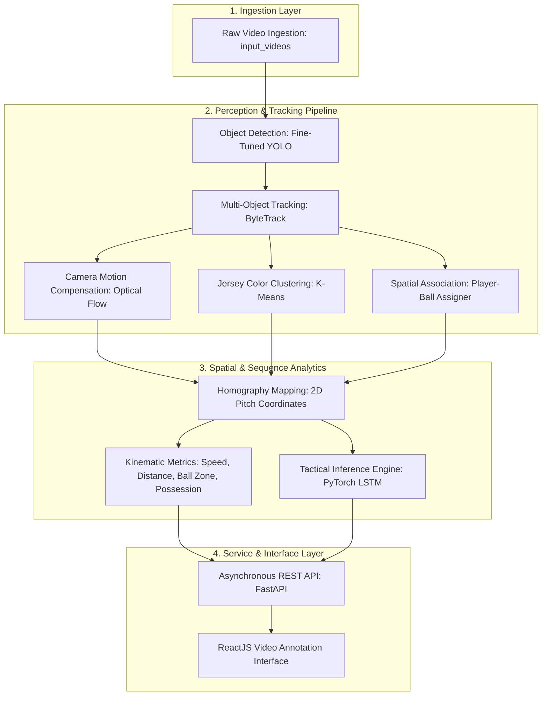

# Sports Tactics AI Analyzer ⚽

[](https://www.python.org/)
[](https://fastapi.tiangolo.com/)
[](https://reactjs.org/)
[](https://pytorch.org/)
[](https://opencv.org/)
[](https://github.com/ultralytics/ultralytics)
[](LICENSE)

> Applied computer vision research to engineer an AI-assisted sports tactical analysis web application.

---

## Executive Summary

| Parameter | Specification |
| :--- | :--- |
| **Timeline** | August 2025 |
| **Context** | Web & AI Research Internship @ Djagora Foundation |
| **Role** | Full-Stack AI Research & Software Engineering Intern |
| **Primary Focus** | Computer Vision Tracking, Deep Sequence Modeling, Web Application Integration |

---

## Key Contributions

- **Developed a custom video annotation interface utilizing modern ReactJS frameworks**, enabling performance analysts to interact with synchronized match footage, visual object overlays, and real-time event telemetry.
- **Orchestrated and integrated third-party AI APIs to automate tactical pattern detection**, creating an asynchronous pipeline connecting deep learning inference models with client-side analytical views.
- **Streamlined complex video processing workflows to enhance user experience and analytical precision**, transforming raw broadcast footage into calibrated metric pitch coordinates, speed profiles, and pressing intensity indexes.

---

## Tech Stack

### Frontend Architecture
- **Framework:** ReactJS (ES6+, Functional Components, Hooks)
- **Visual Presentation:** Modern Responsive UI, HTML5 Video & Canvas Rendering
- **Client Networking:** Asynchronous REST Client (Axios / Fetch API)

### Backend & API Services
- **Language:** Python 3.9+
- **API Framework:** FastAPI, Starlette, Pydantic
- **ASGI Server:** Uvicorn (Asynchronous Worker Engine)
- **Middleware:** CORS Cross-Origin Management, High-Concurrency Request Handlers

### Computer Vision & Object Tracking
- **Object Detection:** Ultralytics YOLO (Fine-tuned for football pitch entity detection: players, referees, ball)
- **Multi-Object Tracking (MOT):** Supervision ByteTrack algorithm with track persistence and Kalman filter state prediction
- **Kinematic Compensation:** Lucas-Kanade Sparse Optical Flow (`cv2.calcOpticalFlowPyrLK`) for camera motion compensation
- **Metric Transformation:** Planar Homography & Perspective Transformation for pixel-to-pitch 2D coordinate projection
- **Image Processing:** OpenCV (`cv2`)

### Machine Learning & Pattern Classification
- **Deep Sequence Modeling:** PyTorch LSTM (`lstm_model99344.pth`) for high-level tactical pattern recognition (e.g., defensive pressing blocks)
- **Unsupervised Segmentation:** Scikit-Learn K-Means Clustering on RGB/HSV feature distributions for player jersey classification

### Scientific Computing & Data Pipeline
- **Numerical Processing:** NumPy
- **Tabular Data & Trajectory Interpolation:** Pandas
- **Visualization:** Matplotlib

---

## System Architecture



---

## Core Capabilities & Features

### 1. Robust Multi-Object Detection & Tracking
- Detects players, match officials, and the ball across varying lighting, camera angles, and occlusions.
- Maintains identity persistence using ByteTrack association matrices.
- Recovers occluded ball trajectories using forward-backward spline interpolation.

### 2. Automated Team Identification via Unsupervised Clustering
- Automatically crops upper-body bounding boxes to isolate jersey color distributions.
- Applies K-Means clustering to partition players into opposing squads, goalkeepers, and referees without manual labeling.

### 3. Camera Movement Compensation & Homography Projection
- Corrects for camera panning, tilting, and zooming by tracking background landmark points using Lucas-Kanade optical flow.
- Maps pixel coordinate trajectories onto standard 2D pitch models (meters) through homographic perspective transformation.

### 4. Quantitative Performance & Spatial Telemetry
- **Possession Statistics:** Computes frame-by-frame ball possession percentages based on dynamic player-ball proximity thresholds.
- **Pitch Zone Classification:** Segments play dynamically into Defensive, Midfield, and Attacking thirds.
- **Kinematic Measurements:** Computes player speed ($km/h$) and total distance covered ($m$).
- **Pressing Intensity Index:** Calculates real-time defensive pressure exerted on the ball carrier within calibrated distance radii.

### 5. Automated Tactical Classification via Recurrent Neural Networks
- Evaluates temporal sequences using a PyTorch LSTM model (`lstm_model99344.pth`).
- Classifies collective tactical behaviors (such as `pressing_haut` / high press) with accompanying confidence intervals.

---

## API Reference

The backend provides an asynchronous RESTful API exposed through FastAPI:

| HTTP Method | Route | Description | Response Type |
| :--- | :--- | :--- | :--- |
| `GET` | `/` | API status index and service catalogue | `application/json` |
| `GET` | `/health/` | Service health status and readiness probe | `application/json` |
| `GET` | `/collect-files/` | Ingests sequence features, computes analytics, and outputs tactical payload | `application/json` |
| `GET` | `/docs` | Interactive OpenAPI / Swagger UI sandbox | `text/html` |

---

## Getting Started

### Prerequisites

Ensure the following environments are installed on your host system:

- **Python:** Version 3.9 or higher
- **Node.js:** Version 16.x or 18.x with `npm`
- **Git:** Version 2.30+

---

### Installation & Environment Setup

#### 1. Clone the Repository
```bash
git clone https://github.com/moatazz12/Sports-Tactics-AI-Analyzer.git
cd Sports-Tactics-AI-Analyzer
```

#### 2. Configure Python Virtual Environment
```bash
# Windows (PowerShell)
python -m venv venv
.\venv\Scripts\Activate.ps1

# Linux / macOS
python3 -m venv venv
source venv/bin/activate
```

#### 3. Install Backend Dependencies
```bash
pip install fastapi uvicorn ultralytics supervision opencv-python scikit-learn torch pandas numpy matplotlib requests
```

---

### Running the Services

#### Option A: FastAPI Backend Server

Run the API service directly:
```bash
python api_server.py
```

Alternatively, use the provided automation scripts:
```powershell
# PowerShell
.\start_api.ps1

# Windows Batch
start_api.bat
```

The API endpoints will be accessible at:
- **Service Endpoint:** `http://localhost:8000`
- **Interactive Documentation:** `http://localhost:8000/docs`

To run diagnostic checks against the API:
```bash
python check_api.py
```

#### Option B: ReactJS Video Annotation Interface

Navigate to the frontend application directory and start the development server:
```bash
cd frontend
npm install
npm start
```

The web application will launch locally at `http://localhost:3000`.

---

## Repository Structure

```text
Sports-Tactics-AI-Analyzer/
├── api_server.py                  # FastAPI asynchronous REST backend
├── check_api.py                   # Automated API diagnostic & validation script
├── start_api.bat                  # Windows Batch launcher
├── start_api.ps1                  # PowerShell launcher
├── start_api_simple.py            # Minimal Python API launcher
├── lstm_model99344.pth            # Trained PyTorch LSTM weights for tactical classification
├── video_analysis_with_lstm.ipynb # Jupyter notebook for sequence model development
│
├── camera_movement_estimator/     # Optical flow camera motion compensation
│   └── camera_movement_estimator.py
├── color_assigner/                # K-Means clustering for jersey color extraction
│   └── color_assigner.py
├── team_assigner/                 # Team categorization logic
│   └── team_assigner.py
├── player_ball_assigner/          # Ball possession and proximity logic
│   └── player_ball_assigner.py
├── trackers/                      # YOLO + ByteTrack tracking pipeline
│   └── tracker.py
├── view_transformer/              # Homography perspective projection to pitch meters
│   └── view_transformer.py
├── utils/                         # Bounding box and video processing utilities
│   ├── bbox_utils.py
│   └── video_utils.py
│
├── models/                        # Trained model checkpoints
│   └── best.pt                    # Fine-tuned YOLO detection model
├── input_videos/                  # Source match video files
├── output_videos/                 # Extracted telemetry, features, and analysis JSON
└── stubs/                         # Serialized tracking stubs (.pkl) for rapid prototyping
```

---

## License & Internship Context

This project was developed during the **Web & AI Research Internship** at **Djagora Foundation** (August 2025). Licensed under the MIT License.